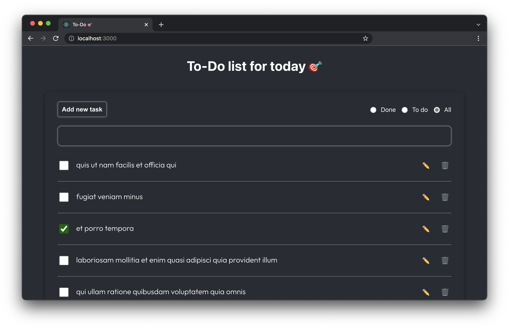

# To-Do list
ToDo list example with Typescript, React, react-router, Apollo client.

## Description

Simple TODOs list with handle all CRUD operations + filtering by title (text input), by status. Graphql endpoint https://graphqlzero.almansi.me/api was used in the process.

App has 3 pages:
* main view
* editing to-do
* creating to-do

What needs to be added in the future? Tests, lazy loading of todos on scroll.

## How to use
* `git clone` this repository;
* `npm install` all dependencies;
*  type `npm start`, if you want to run app;